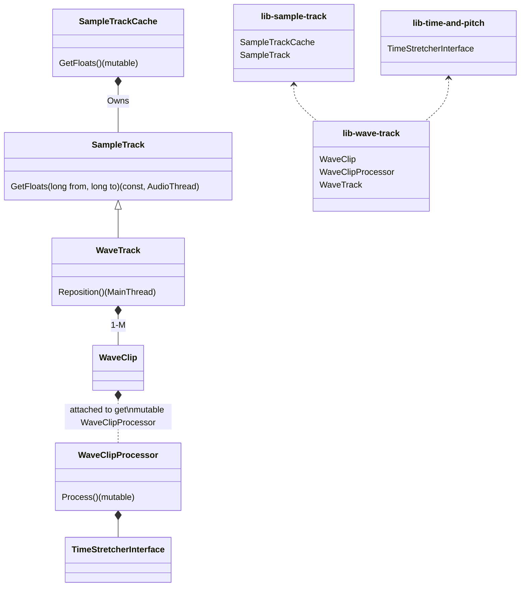
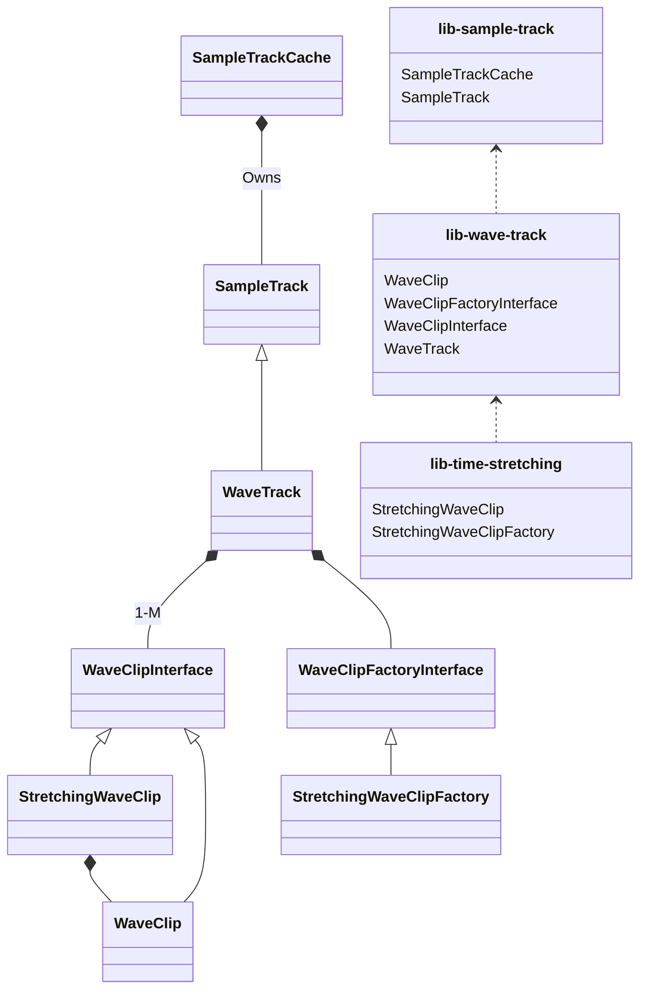
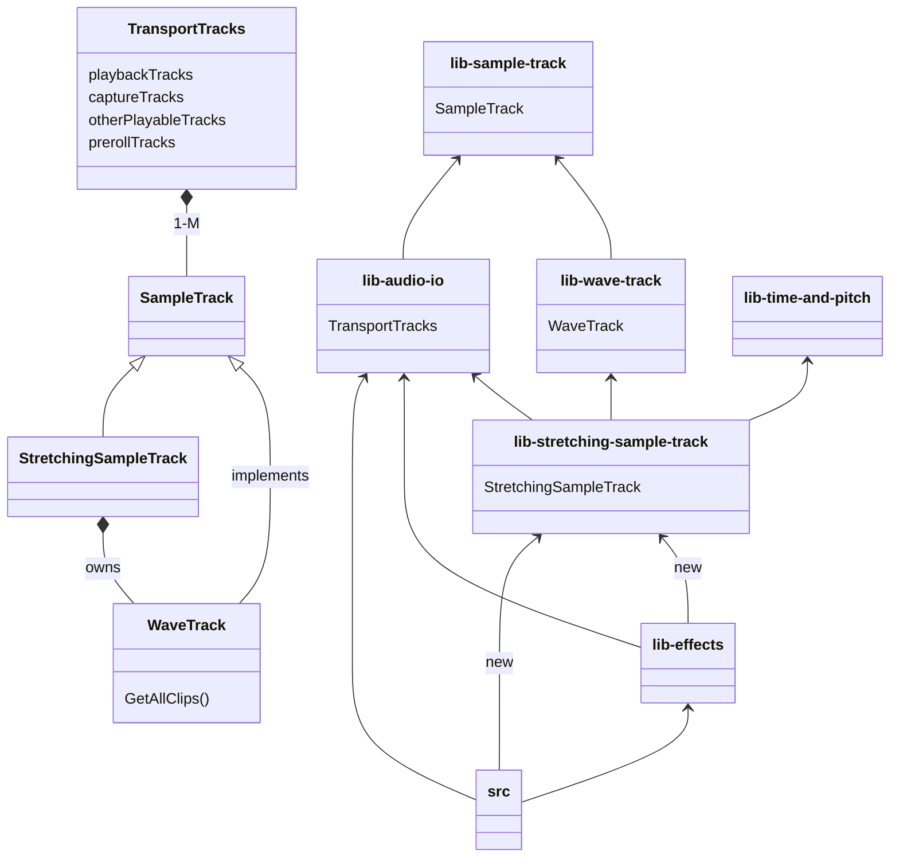

# Refactoring of PoC

## Current

### Note
`WaveTrack::GetFloats` is a const function, made possible by having the client pass the `from` and `to` arguments and the rest just being readout of const audio. Time stretching is a stateful operation and must be done at clip level. To keep constness of `GetFloats`, either the time stretching state is passed down from `SampleTrackCache::GetFloats` (still mutable) or, like now, a `const_cast` is made on `WaveClip` is made so as to access a mutable reference to its attached `WaveClipProcessor`.

Since it is guaranteed (?) that access of the members involved in `WaveTrack::GetFloats` and `WaveTrack::Reposition` are not concurrently accessed by `MainThread` and `AudioThread`, const-casting for the purpose of time stretching during playback should be fine. This alleviates the duty on the client to maintain the time-stretching state.

---

## Proposal A

Simplest, but may suffer quality problems : unstretched clip A may transition without a *click* into unstretched clip B, but time-stretching either or both could introduce clicking.

---

## Proposal B

The `StretchingSampleTrack` proposal, wrapping `WaveTrack` and replacing the `playbackTracks` member of `TransportTracks`. (What are the `otherPlayableTracks`?).

Clients of `TransportTracks` now inject a `StretchingSampleTrack` factory in its constructor. This factory is provided by `lib-stretching-sample-track`.

