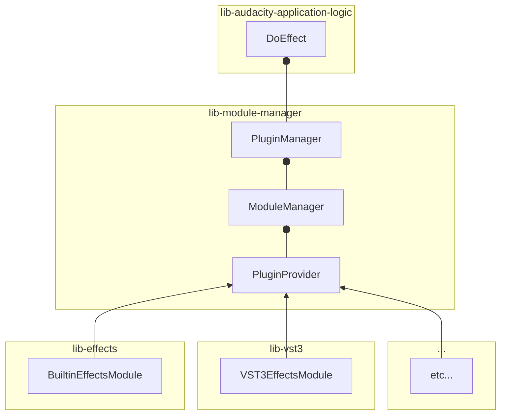
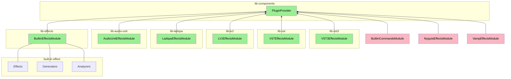
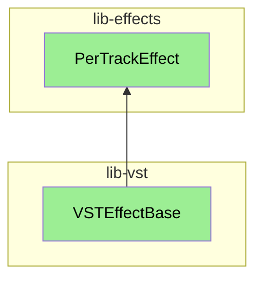

# Overview
Important building blocks of the Audacity 3 effect framework.

Bullet from A to B means _A uses B_.

Arrow from A to B means _A implements B_.

### ModuleManager

Discovers and gives access to the available `PluginProvider`s.

### PluginProvider

Implementations must be able to provide a list of `PluginPaths`s, and, given a path, create a `ComponentInterface` instance.

### PluginDescriptor

API (not exhaustive):
* `GetId()`
* `IsEnabled()`
* `GetUntranslatedVersion()` (How is this used?)
* `IsValid()` (see plugin validation)
* `GetEffectFamily()` (for menu categorization)
* `GetEffectType()` (for menu categorization)
* `IsEffectRealtime()` : manager also aware of real-time effects

### PluginManager

Mostly just takes care of the plugin registry.

# PluginProvider implementations
Implementations of `PluginProvider`.

The `BuiltinEffectsModule` encompasses built-in effects, but also generators and analyzers.

(It's unclear to me why the suffix `Module` ; wouldn't `Provider` be better, e.g. `VST3EffectsProvider` ?)

These are discovered by the `ModuleManager`.

In each of these libs, typically one finds also implementations of some effect abstraction used by the framework, such as

# Plugin Validation

Plugin validation is done in another process. The validation produces `PluginDescriptor`s, which are serialized and sent back to the main process.

`PluginStartupRegistration` implements `AsyncPluginValidator::Delegate`, and uses `PluginManager::Get().RegisterPlugin(<some PluginDescriptor object>);` to publish result of the discovery process. It is not part of any library.

# DoEffect

What the body of the `DoEffect` function does:

1. Get `PluginDescriptor` from `PluginManager` using ID argument
2. Get selected tracks
3. Get effect instance for ID argument (using `EffectManager`)
4. Get current effect settings from `pluginsettings.cfg`
5. Call `DoEffect` on effect instance with settings
6. Effect instance shows UI
7. Effect instance processes audio
8. Track data updated
8. Settings updated in `pluginsettings.cfg`
9. Updates project history (N/A ?)
10. Updates "Repeat last effect/generator/..." (N/A ?)
11. If effect is generator, zoom to fit result (N/A)
12. Redraw, select track, focus on track (N/A)
