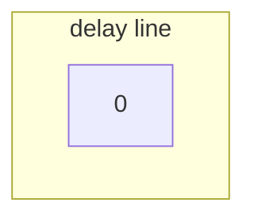
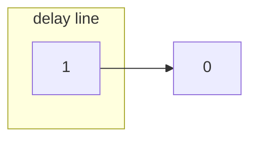
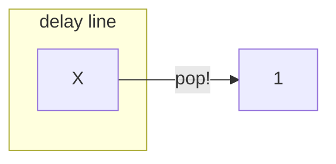
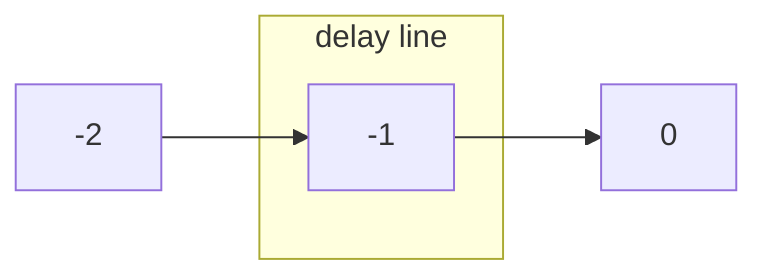

# `StretchingSequence`

`StretchingSequence` supports (continuous) forward, (continuous) backward, and random sample access.

Random access comes with computational overhead, due to the statefulness of the implementation. Indeed, the stretching implementation uses a Short-Time Fourier Transform (STFT), which, for the purpose of this explanation, can be simplified to a delay line of size 1. Now let's see which implications this has.

## Forward access

Suppose the user requests sample of index 0. We first push 0 into the delay line.

Now we must push some other sample against 0 to have it pop out on the other side.

What sample is X? If we expect the user to request sample 1 next, X should be sample 1:

This way, when the user requests 1, we just have to do one push operation, and 1 will pop out.

This is the continuous forward scenario, and the most typical one.

## Backward access
Audacity's _scrubbing_ feature allows users to play their tracks _backwards_. The code using `StretchingSequence` can make `StretchingSequence` aware of it. Then our implementation is easily extended to support backward requests: after 0 instead of pushing 1 we now push -1, then -2, and so on.

## Random access
In a random access situation, we don't know what samples are queried in what order. Say we have pushed samples 1 to get sample 0 out, but next the user requests sample 10. Now we have to do **two** push operations to get 10 out, instead of just one if sample 1 had been requested.

In this situation, `StretchingSequence` will just do this: refill the buffer and have it time stretched to produce the requested sample. It will work, but with a computational overhead.

## Afterthoughts

### Looping
The most common situation where random access is necessary is looping.

If the `StretchingSequence` could be told the loop boundaries, its implementation could be extended to avoid those state resets each time the cursor loops over. Quality-wise, if the raw audio looped without a click, then so would the stretched loop. (This would leave the responsibility on to the user to have smooth loops, though, which maybe isn't the best Audacity can do to ease the user experience. We may want to offer automated cross-fading, and not only for looping, but also to smoothly join clips together.)

Computationally, we explained above why a loop-unaware implementation would perform suboptimally. This may not be noticeable, though, in which case we may be better off with simpler code and more time to do something else.
