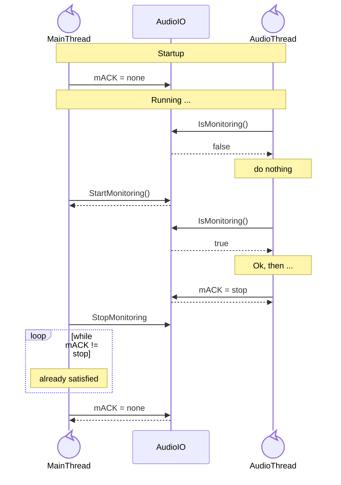
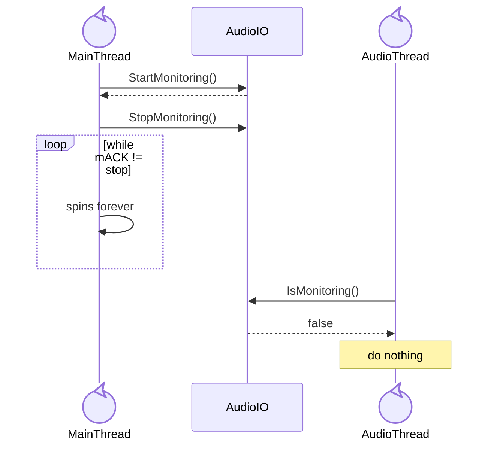
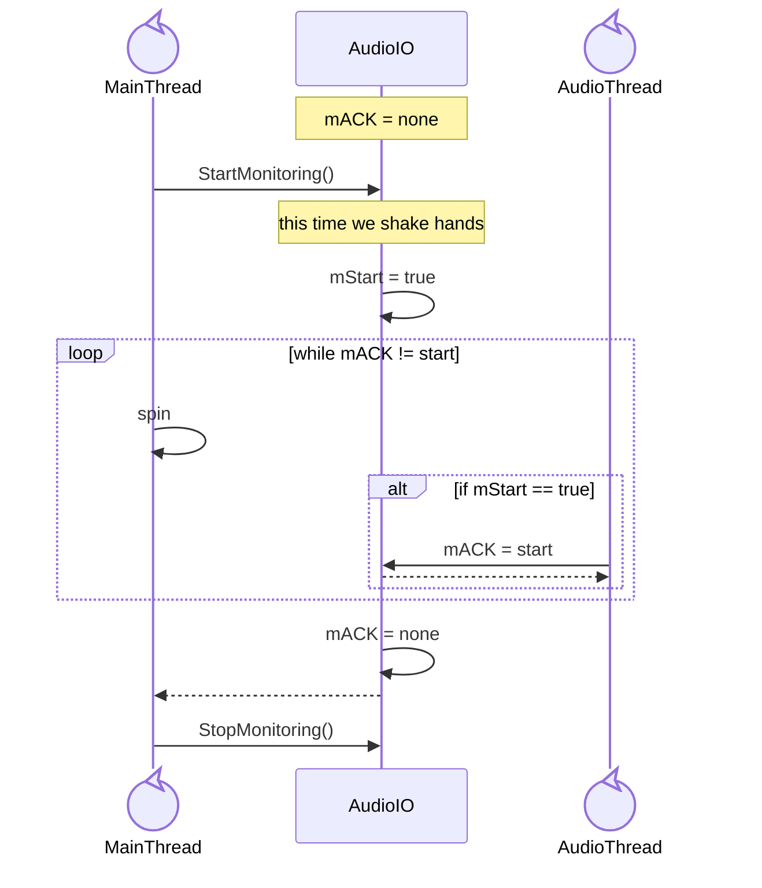

# [11571](https://github.com/audacity/audacity/issues/11571)

## Intro

Issue [Audacity freezes when adding a track](https://github.com/audacity/audacity/issues/11571) exposed a deadlock, that was never uncovered before (although foreseen by Paul Licameli), but due to programmatic-fast start/stop monitoring event sequence finally was reproduced.

We draw here an explanation to strengthen the intuitive understanding of an otherwise rather complex construct. This is a simplification.

## Happy path

## Deadlock

`StopMonitoring()` comes after `StartMonitoring()`, _before_ AudioThread can set `mACK = stop`

## StartMonitoring handshake

## Notes

Those diagrams are a simplification. The handshake mechanism in fact primarily applies to start/stop of playback or recording, ie., of buffer exchange between the audio thread (where audio is processed) and the driver thread (soundcard IO).

In fact, for audio monitoring, one needs an _open stream_ but not the audio thread at all, and even less buffer exchange. There are hence two ways the deadlock can be resolved:

- extending the handshake mechanism to monitoring - small diff but adds complexity
- decoupling monitoring from the audio thread completely - bigger diff, but final state should be simpler.
