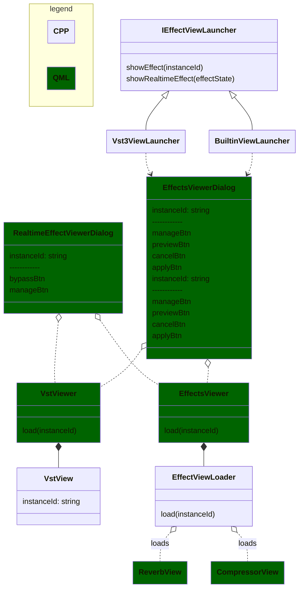

```mermaid
---
  config:
    class:
      hideEmptyMembersBox: true
---
classDiagram
  VstViewer *-- VstView

  namespace legend {
    class CPP
    class QML:::qml
  }

  class IEffectViewLauncher {
    showEffect(instanceId)
    showRealtimeEffect(effectState)
  }


  IEffectViewLauncher <|-- Vst3ViewLauncher
  IEffectViewLauncher <|-- BuiltinViewLauncher

  RealtimeEffectViewerDialog o.. EffectsViewer
  RealtimeEffectViewerDialog o.. VstViewer
  EffectsViewerDialog o.. VstViewer
  EffectsViewerDialog o.. EffectsViewer
  EffectsViewer *-- EffectViewLoader
  EffectViewLoader o.. ReverbView: loads
  EffectViewLoader o.. CompressorView: loads
  Vst3ViewLauncher ..> EffectsViewerDialog
  BuiltinViewLauncher ..> EffectsViewerDialog

  class ReverbView:::qml
  class CompressorView:::qml

  class EffectViewLoader {
    load(instanceId)
  }

  class EffectsViewerDialog:::qml {
    instanceId: string
    ------------
    manageBtn
    previewBtn
    cancelBtn
    applyBtn
  }

  class EffectsViewerDialog:::qml {
    instanceId: string
    ------------
    manageBtn
    previewBtn
    cancelBtn
    applyBtn
  }

  class RealtimeEffectViewerDialog:::qml {
    instanceId: string
    ------------
    bypassBtn
    manageBtn
  }

  class EffectsViewer:::qml {
    load(instanceId)
  }

  class VstViewer:::qml {
    load(instanceId)
  }

  class VstView {
    instanceId: string
  }

  classDef qml fill:darkgreen
```
