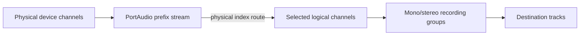

# ADR: Grouped recording input-channel selection

Date: 2026-09-04

## Status

Proposed

## Context

Audacity previously stored one recording-channel count. Selecting `N` meant
opening and recording the physical prefix `1..N`, so channels 3 and 4 could not
be recorded without also recording channels 1 and 2.

One integer was serving several different purposes:

- the user's source selection;
- PortAudio's input stream width;
- the number of logical capture buffers; and
- the number and layout of destination track channels.

Those values diverge as soon as a user selects a high or non-contiguous input.
For example, mono channel 1 plus stereo channels 3+4 is three logical capture
channels arranged as two recording groups, while a portable PortAudio stream
must be four channels wide.

The feature crosses two repository layers. The application configuration, UI,
recording controller, and AU3 adapter live under `src/`. Device discovery,
PortAudio stream management, and the real-time capture path live under
`au3/libraries/`. The `muse` submodule supplies framework primitives but does
not own Audacity's recording policy, so this feature is implemented in the
Audacity repository.

Audacity also has one process-wide AudioIO stream. Selection changes therefore
continue to use the existing driver-controller transaction, stream ownership,
suspension, rollback, and notification behavior.

## Decision

### Model selected recording groups explicitly

The authoritative configuration value is an ordered collection of groups:

```cpp
using InputChannelIndex = uint32_t;

struct InputChannelGroup {
    std::vector<InputChannelIndex> channels;
};

using InputChannelSelection = std::vector<InputChannelGroup>;
```

For this increment:

- a one-channel group represents a mono destination;
- a two-channel group represents a stereo destination;
- every physical channel is offered as mono;
- stereo groups are conventional non-overlapping pairs `1+2`, `3+4`, and so
  on;
- groups and channels are stored in ascending physical order;
- a physical channel may occur in only one group; and
- at least one group remains selected while the device has inputs.

Choosing a group atomically replaces any selected group that overlaps it.
Thus choosing `1+2` removes mono `1` and mono `2`, while choosing mono `1`
removes stereo `1+2`.

The logical channel count is derived by flattening the groups. The PortAudio
stream width is derived separately as `highest selected physical index + 1`.
Neither is independently writable application configuration.

### Keep policy and persistence in the driver controller

`IAudioDriverController` remains the owner of process-wide audio
configuration. `Au3AudioDriverController` normalizes selections against the
resolved device capacity, persists them, emits a typed configuration delta,
and applies them through the existing stream transaction.

The versioned setting `AudioIO/RecordChannelSelectionV1` stores nested,
zero-based lists. For example, mono 1 plus stereo 3+4 is stored as
`[[0], [2, 3]]`.

Legacy `AudioIO/RecordChannels` values are clamped to the available input
capacity before migrating as follows (zero available inputs yields an empty
selection):

| Legacy value | Grouped selection | Preserved layout |
| --- | --- | --- |
| `1` | `[[0]]` | one mono track |
| `2` | `[[0, 1]]` | one stereo track |
| `N > 2` | `[[0], [1], ...]` | `N` mono tracks |

The old setting is mirrored as the flattened logical channel count for legacy
readers. It is compatibility data, not a second source of truth. The physical
route and required PortAudio prefix width come from the versioned selection.

On an input-device or capacity change, an exact legacy preset retains its
count-based behavior: its count is reduced to the available capacity and the
corresponding preset is selected. For example, four mono inputs reduced to a
two-input device become stereo 1+2. Increasing capacity does not restore
discarded inputs.

Custom selections retain groups that remain fully in range, discard invalid
groups, and fall back to mono channel 1 if nothing valid remains. Separate
mono groups 1 and 2 remain separate, including previously saved selections;
they are not the stereo preset. Per-device selection memory is deferred.

### Snapshot the selection at stream startup

Recording and monitoring pass the validated selection through
`IAudioEngine::StartStreamOptions` (or the explicit monitoring argument) into
`AudioIOStartStreamOptions`. AudioIO stores that route for the stream lifetime
and does not reread mutable preferences to decide which samples to use.

The modern application type is converted to a plain nested vector at the AU3
adapter boundary, keeping the legacy library independent of `src/audio`.
Application policy limits stereo choices to conventional adjacent pairs in
this increment. AudioIO validates only executable route structure, uniqueness,
logical channel count, and device range, so that policy does not leak into the
engine.

### Separate physical, stream, logical, and destination channels



The portable implementation opens the prefix ending at the highest selected
physical channel. AudioIO allocates capture buffers only for the flattened
logical selection and deinterleaves each buffer from its selected physical
index using the raw PortAudio stride.

For `[[0], [2, 3]]`, PortAudio opens four channels, while AudioIO creates three
logical capture buffers sourced from stream channels 0, 2, and 3. New-track
recording creates one mono track followed by one stereo track.

Recording into existing selected tracks preserves the previous total-channel
compatibility and mono/stereo up/down-mix behavior. Grouping controls the
layout of newly created tracks; it does not silently redefine existing-track
selection rules.

### Route every live-input consumer

All consumers use the immutable selected route:

- disk recording receives only flattened selected channels;
- per-track meters follow the logical-to-track route;
- the main input meter displays one or two selected logical channels
  independently, regardless of grouping; larger selections use the maximum
  sample magnitude contributing to each of its two bars;
- sound-activated recording inspects only selected physical channels; and
- software playthrough mixes selected groups to stereo, centering mono groups,
  preserving stereo left/right, dividing by the number of groups, and
  clamping the result.

For main metering with three or more inputs, mono groups contribute to the
left bar at even group indices and the right bar at odd indices. Stereo
groups always contribute their first and second inputs to the left and right
bars respectively. Group indices refer to the stored selection order. The
resulting per-sample magnitude envelopes feed the existing peak/RMS
calculation without averaging or an additional clamp in AudioIO.

This preserves the legacy maximum-based approach while explicitly correcting
its missing multichannel meter signal before recording, incorrect source
indexing when destination-track counts differ, and discarded negative
samples. Per-track metering also corrects the legacy repeated-first-input
behavior and reflects the existing stereo-to-mono downmix or mono-to-stereo
duplication. Ordinary mono/stereo main-meter samples and the downstream
peak/RMS calculation, clipping, decay, and timing remain unchanged.

### Keep the first release cross-platform

PortAudio is used by Audacity's active desktop audio path on macOS, Windows,
and Linux. Its generic stream interface reliably accepts a channel count but
does not expose one universal arbitrary channel-map API. The first increment
therefore uses prefix-and-route on Core Audio, WASAPI/ASIO, ALSA/JACK, and other
PortAudio hosts.

Native compact maps remain a later optimization. They may reduce transferred
channels but must not change the configuration model, group order, track
layout, or monitor mix.

Sample-rate capability caches include the actual input stream width in their
keys. This prevents a rate probed for a narrow stream from being reused for a
wider prefix.

### Use count presets in Audio Setup and edit groups in Preferences

Preferences uses a multi-select popup and retains staged Apply/Cancel
semantics. It shows numeric mono labels (`1`, `2`, ...) and stereo labels
(`1+2`, `3+4`, ...), using the shared domain toggle and normalization rules.

The Audio Setup toolbar retains the channel-count presets from `1` through
the input device's capacity. Choosing a preset replaces the entire selection
immediately using the legacy mapping: `1` is mono channel 1, `2` is stereo
1+2, and higher counts select the first N channels as separate mono groups.
A preset is checked only when the complete selection, including grouping,
matches it. Choosing the active preset leaves the selection unchanged and
keeps it checked.

An ordinary, non-checkable `Custom...` command follows the presets after a
separator and opens the existing Audio settings page without changing the
selection. A nonempty selection that matches no available preset changes
the parent submenu label to `Recording channels: Custom`; no preset is
checked. With no available inputs or an empty selection the label remains
`Recording channels`.
A device with no inputs offers only `Custom...`, without a separator.

This keeps custom state separate from the command that opens its editor.
The toolbar retains the shared menu's normal close-on-activation behavior;
making it a persistent multi-select editor would require changes to Muse's
menu lifecycle. The existing Preferences popup already supports editing
multiple groups without reopening it.

## Consequences

The feature works consistently across supported desktop platforms without
waiting for host-specific channel maps. Recording channels 3+4 no longer
creates unwanted tracks for channels 1+2, although a generic backend still
transfers the lower channels internally as part of the PortAudio prefix.

Channel identity now survives from UI configuration to the real-time callback,
and count-based callers cannot independently overwrite it. The cost is a
broader change spanning configuration, persistence, stream startup, real-time
routing, track creation, meters, and two UI surfaces.

## Deferred work

- remembering selections independently per input endpoint;
- host-provided channel names;
- native compact maps for individual host APIs;
- arbitrary stereo pairs;
- user-defined group or channel ordering; and
- a richer multichannel meter presentation.

## Alternatives considered

Keeping a count plus a bit mask was rejected because it preserves two writable
sources of truth and does not represent destination grouping. Filtering only
before track writes was rejected because monitoring, meters, and sound
activation would disagree with the recording. Implementing only on hosts with
native channel maps was rejected because the feature would not be
cross-platform. Moving the implementation into `muse` was rejected because
the framework does not own Audacity's configuration transaction, recording
track policy, or AU3 PortAudio path.
