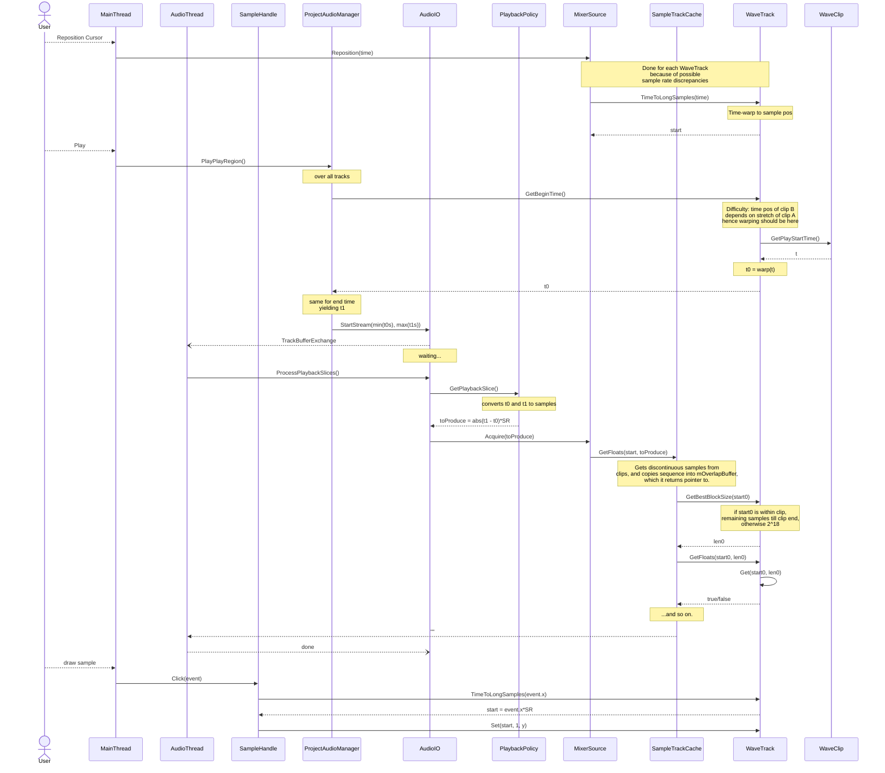
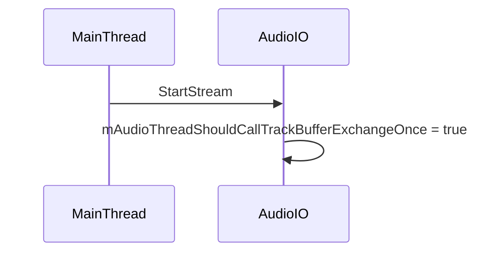

# `WaveClip` API

We'll want clip-level time stretching to be done on the fly. This means that the time-to-sample (index) ratio is now clip-dependent.
At this time, we can expect clip indices to be calculated using `n = (t - t_clipBegin) * SR`. Clip indices may be thought of as _relative samples_, meanwhile track 

Since we want time stretching to be non-destructive, we store the clip samples in their original timing. With time stretching, though, the constant relationship _R_ `sampleIndex = t * sampleRate` doesn't holds anymore. Now an ambiguity arises when dealing with sample indices : are those of stretched samples (where _R_ holds) and those of original samples. For example :
Method | Description | Should be stretched ? |
-------|-------------------|-----|
`WaveClip::GetSequenceStartSample()` | | No :  |
`WaveClip::GetSequenceEndSample()` | Unused | Doesn't matter since unused |
`WaveClip::GetSequenceSamplesCount()` | Used in `EstimateCopyBytesCount` | No |
`WaveClip::TimeToSequenceSamples(t)` | Used in `WaveTrack` to git track RMS by weighting clip RMSs | Yes - although individual clip RMS don't change whether stretched or not, their contribution in this case must be weighted by their perceived length.|
`long WaveTrack::GetBlockStart(long smp)` && `::GetBestBlockSize(long smp)` | Used by `SampleTrackCache` to know hom many samples are available from `smp` till the end of the memory block. | Probably, if `smp` is an _R_ conversion of _t_. |
`long WaveClip::ToSequenceSamples(long smp)` | Used in `WaveTrack::GetBlockStart` | Consistently with `WaveTrack::GetBlockStart()`, yes |
`long WaveClip::GetPlayStartSample()` | Get 1st sample of untrimmed region | Totally unsure ; depends on use, really. |
`Value-Two` | Long explanation||
`etc` | Long explanation||

-  `sampleCount ToSequenceSamples(sampleCount s) const;`
   Would it be possible to have the `WaveClip` interface only deal with time in seconds (`double`) ? This would reduce the ambiguity, when it comes to sample indices, of whether we are talking of time-stretched samples or not.

With the table below we list the public methods that use samples, describe what they are about, and see if all of them could be either gotten rid of or reworked with time unit seconds.

| Method                                                     | Description                                                                  | Uses                                                                                                                             | Alternative                                                                                               |
| ---------------------------------------------------------- | ---------------------------------------------------------------------------- | -------------------------------------------------------------------------------------------------------------------------------- | --------------------------------------------------------------------------------------------------------- |
| `smp TimeToSequenceSamples(double)`                        |                                                                              | By WaveTrack to calculate cross-clip RMS                                                                                         | GetStretchedSquaredSum() and GetStretchedLength() make it even easier for the calculation                 |
| `smp ToSequenceSamples(smp)`                               |                                                                              | By WaveTrack to get num samples into data                                                                                        | GetStretchedSquaredSum() and GetStretchedLength() make it even easier for the calculation                 |
| `smp GetBlockStart(cursorPosSmp)`                          | gets block begin sample if cursor is within playable region                  |                                                                                                                                  |                                                                                                           |
| `smp CountSamples(double t0, double t1)`                   | gets num samples within intersection of [t0, t1] and trimmed clip boundaries | By WaveTrack and internally to see if intersection is empty or not => could be replaced with `bool IntersectsPlayRegion(t0, t1)` |                                                                                                           |
| `bool GetSamples(..., sampleCount start, size_t len, ...)` |                                                                              | By `WaveTrack::Disjoin` and `::Get`                                                                                              | `size_t GetSamples(..., double start, double length, ...)` ? Could avoid need for `GetBlockStart` & Co. ? |
| `GetSequenceEndSample()`                                   |                                                                              | Unused                                                                                                                           |                                                                                                           |

# Sequence Diagram

# Threading Model
