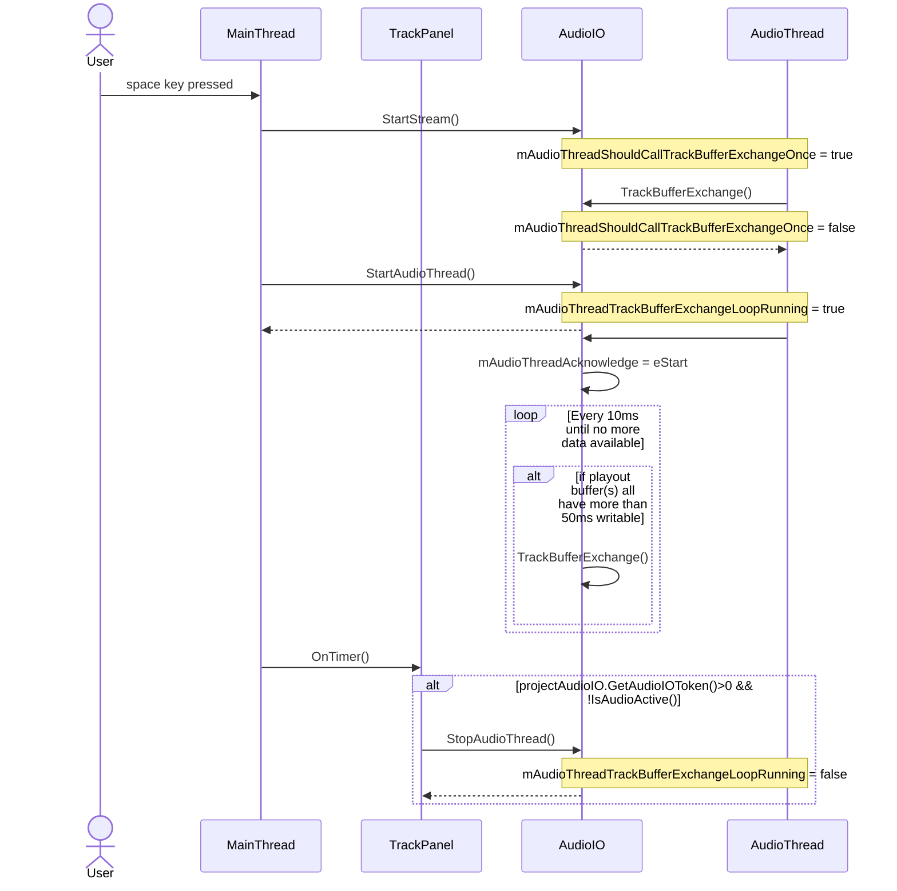

# Threading Model

```mermaid
sequenceDiagram
actor User
participant MainThread
participant TrackPanel
participant AudioIO
participant AudioThread
User ->> MainThread:space key pressed
MainThread ->> AudioIO:StartStream()
Note over AudioIO, AudioThread:mAudioThreadShouldCallTrackBufferExchangeOnce = true
AudioThread->>AudioIO:TrackBufferExchange()
Note over AudioIO, AudioThread:mAudioThreadShouldCallTrackBufferExchangeOnce = false
AudioIO-->>AudioThread: 
MainThread ->> AudioIO:StartAudioThread()
Note over AudioIO, AudioThread:mAudioThreadTrackBufferExchangeLoopRunning = true
AudioIO -->> MainThread: 
AudioThread ->> AudioIO: 
AudioIO ->> AudioIO: mAudioThreadAcknowledge = eStart
loop Every 10ms until no more data available
  alt if playout buffer(s) all have more than 50ms writable
    AudioIO ->> AudioIO: TrackBufferExchange()
  end
end
MainThread ->> TrackPanel:OnTimer()
alt projectAudioIO.GetAudioIOToken()>0 && !IsAudioActive()
  TrackPanel ->> AudioIO:StopAudioThread()
  Note over AudioIO, AudioThread:mAudioThreadTrackBufferExchangeLoopRunning = false
  AudioIO -->> TrackPanel: 
end
```