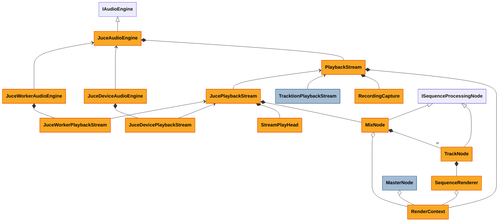

```mermaid
%%{init: {'class': {'hideEmptyMembersBox': true}}}%%
classDiagram

  IAudioEngine <|-- JuceAudioEngine

  class JuceAudioEngine
  class JuceWorkerAudioEngine
  class JuceDeviceAudioEngine
  class PlaybackStream
  class MixNode
  class TrackNode
  class RenderContext
  class JucePlaybackStream
  class JuceWorkerPlaybackStream
  class JuceDevicePlaybackStream
  class RecordingCapture
  class StreamPlayHead
  class SequenceRenderer

  class TracktionPlaybackStream
  class MasterNode

  JuceAudioEngine <-- JuceWorkerAudioEngine
  JuceAudioEngine <-- JuceDeviceAudioEngine

  PlaybackStream <-- JucePlaybackStream
  PlaybackStream <-- TracktionPlaybackStream
  JucePlaybackStream <-- JuceWorkerPlaybackStream
  JucePlaybackStream <-- JuceDevicePlaybackStream


  JuceWorkerAudioEngine *-- JuceWorkerPlaybackStream
  JuceDeviceAudioEngine *-- JuceDevicePlaybackStream

  PlaybackStream *-- RecordingCapture
  PlaybackStream *-- RenderContext

  JuceAudioEngine *-- PlaybackStream
  JucePlaybackStream *-- StreamPlayHead
  JucePlaybackStream *-- MixNode
  MixNode o-- RenderContext
  SequenceRenderer o-- RenderContext
  TrackNode *-- SequenceRenderer

  MasterNode o-- RenderContext

  MixNode *-- "m" TrackNode

  ISequenceProcessingNode <|-- MixNode
  ISequenceProcessingNode <|-- TrackNode

    %% au4juce
  style JuceAudioEngine fill:#f9a825,stroke:#e65100,color:#000
  style SequenceRenderer fill:#f9a825,stroke:#e65100,color:#000
  style MixNode fill:#f9a825,stroke:#e65100,color:#000
  style TrackNode fill:#f9a825,stroke:#e65100,color:#000
  style RenderContext fill:#f9a825,stroke:#e65100,color:#000
  style JuceWorkerAudioEngine fill:#f9a825,stroke:#e65100,color:#000
  style JuceDeviceAudioEngine fill:#f9a825,stroke:#e65100,color:#000
  style PlaybackStream fill:#f9a825,stroke:#e65100,color:#000
  style JucePlaybackStream fill:#f9a825,stroke:#e65100,color:#000
  style JuceWorkerPlaybackStream fill:#f9a825,stroke:#e65100,color:#000
  style JuceDevicePlaybackStream fill:#f9a825,stroke:#e65100,color:#000
  style RecordingCapture fill:#f9a825,stroke:#e65100,color:#000
  style StreamPlayHead fill:#f9a825,stroke:#e65100,color:#000
  %% au4tracktion
  style TracktionPlaybackStream fill:#a3bcd4,stroke:#4a6f94,color:#000
  style MasterNode fill:#a3bcd4,stroke:#4a6f94,color:#000

```
